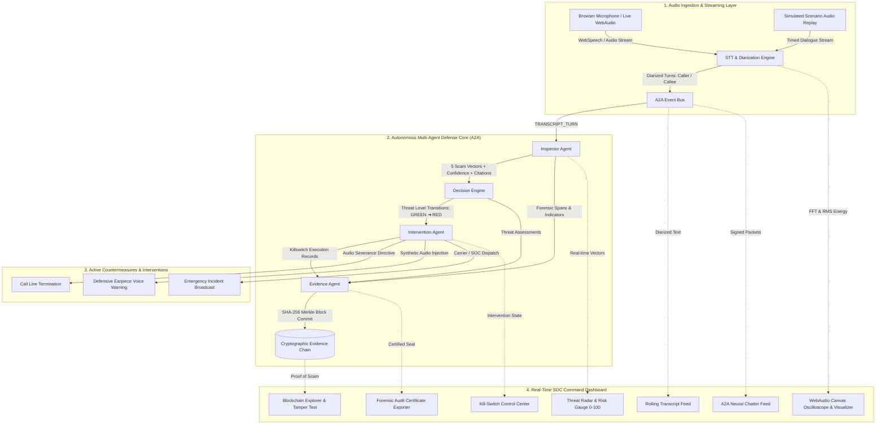
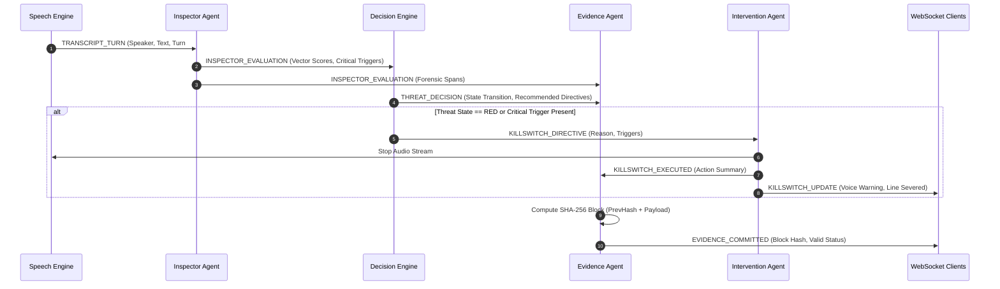
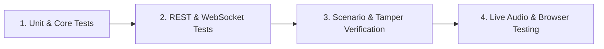
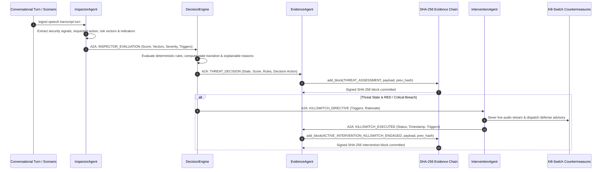
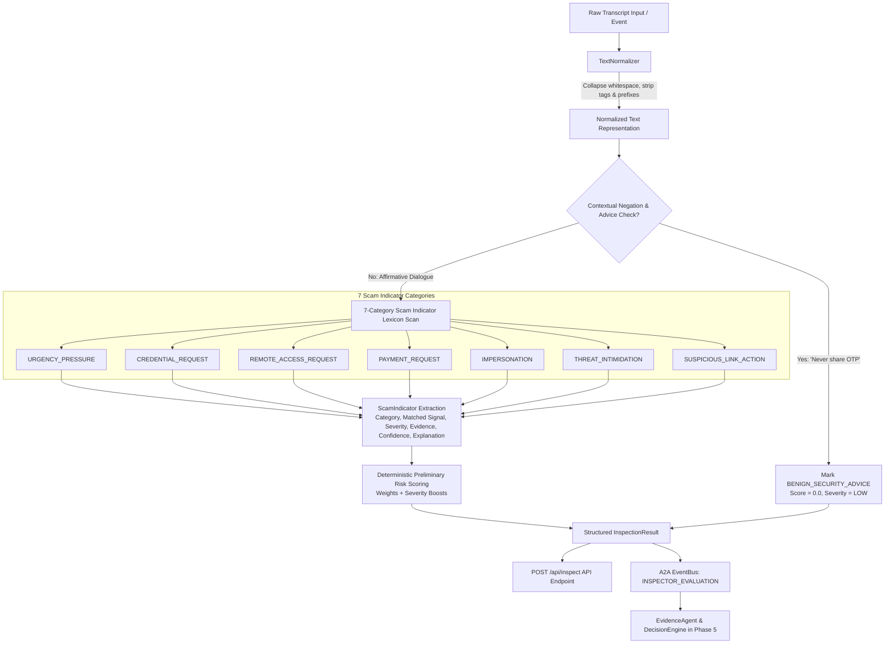
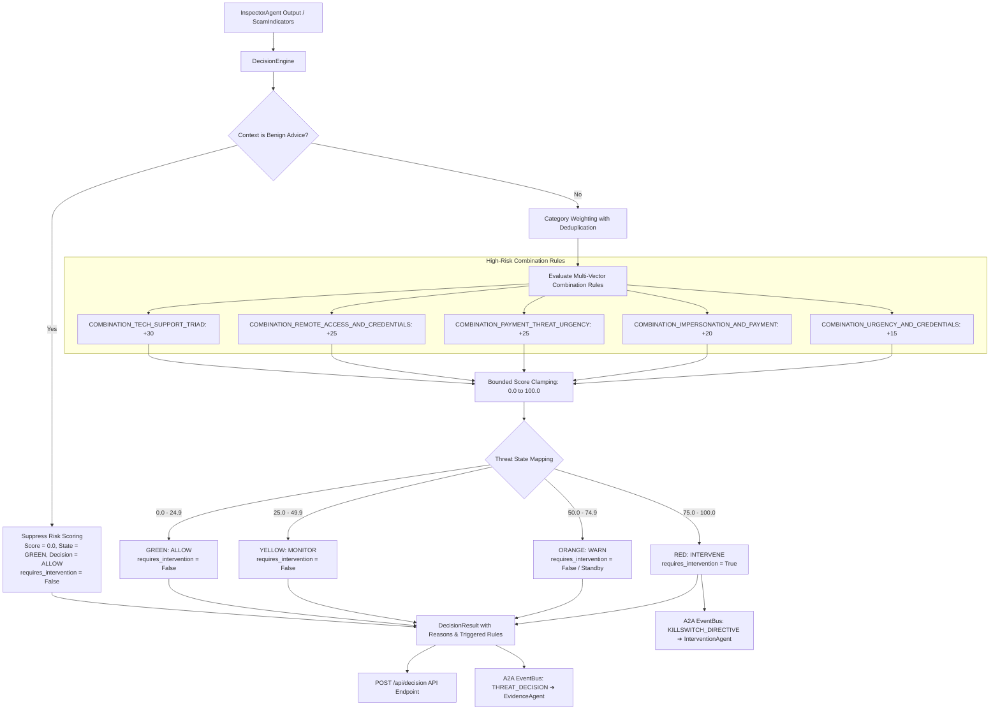
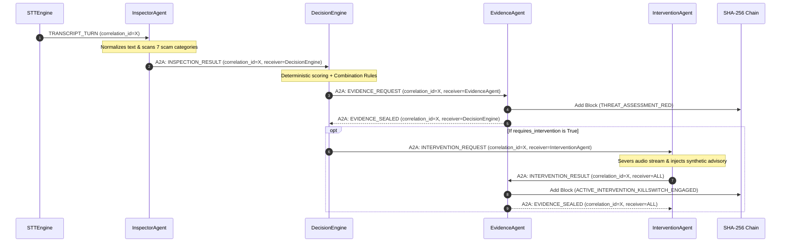
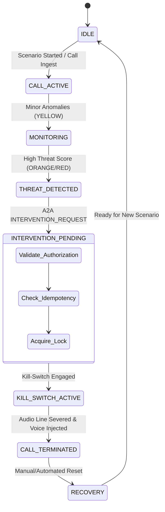
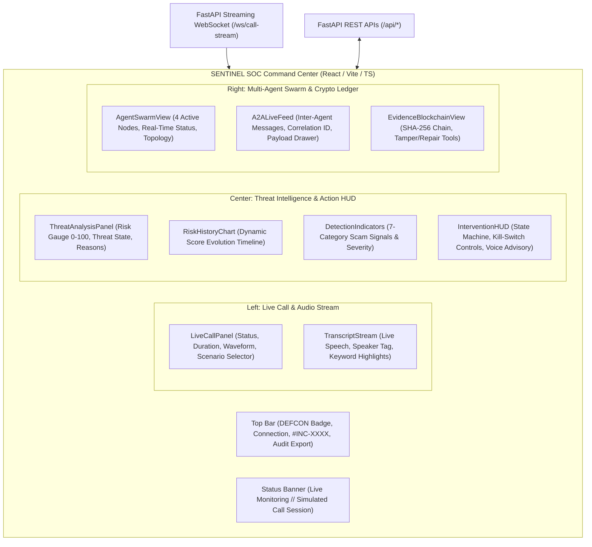
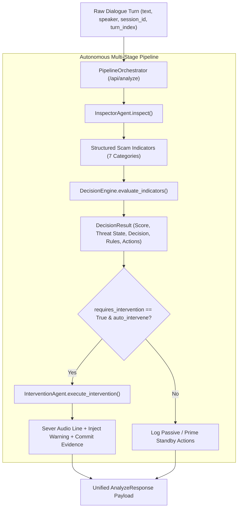

# SENTINEL AI // Technical Architecture Specification

**Document Version:** 2.4.0  
**Classification:** Security Operations Center (SOC) Engineering Specification  
**System Name:** SENTINEL AI Real-Time Scam-Call Detection & Cryptographic Defense Platform  

---

## 1. Executive Summary & System Overview

**SENTINEL AI** is an autonomous, high-assurance cyber-defense system engineered to intercept, analyze, and neutralize telephone and browser-based audio social engineering, financial fraud, and credential-theft attacks in real time. 

By unifying streaming audio ingestion, dual-channel speaker diarization, specialized autonomous agents coordinated over an **Agent-to-Agent (A2A)** messaging protocol, an immutable **SHA-256 cryptographic evidence blockchain**, and active **kill-switch countermeasures**, SENTINEL protects vulnerable users at the point of attack while generating legally defensible forensic evidence.



---

## 2. Complete Repository Directory Structure

```
Unstoppable/
├── backend/
│   ├── agents/
│   │   ├── __init__.py               # Agent package initialization
│   │   ├── inspector.py               # Linguistic & 5-vector scam pattern analyzer
│   │   ├── decision_engine.py         # Multi-factor threat state machine (GREEN/YELLOW/ORANGE/RED)
│   │   ├── evidence_agent.py          # Cryptographic blockchain committer & audit validator
│   │   └── intervention_agent.py      # Active kill-switch, audio severing & voice injector
│   ├── core/
│   │   ├── __init__.py                # Core package initialization
│   │   ├── config.py                  # Pydantic v2 Settings, threat thresholds & vector weights
│   │   ├── a2a.py                     # Strongly typed Agent-to-Agent pub/sub message bus
│   │   └── crypto_chain.py            # SHA-256 immutable evidence blockchain engine
│   ├── engine/
│   │   ├── __init__.py                # Engine package initialization
│   │   ├── scenarios.py               # High-fidelity realistic scam & benign scenarios
│   │   └── stt_engine.py              # Speech-to-Text & streaming dialogue manager
│   ├── tests/
│   │   ├── __init__.py                # Test package initialization
│   │   └── test_sentinel.py           # Automated pytest test suite (100% pass)
│   ├── main.py                        # FastAPI entrypoint, REST APIs & WebSocket server
│   └── requirements.txt               # Pinned backend Python dependencies
├── frontend/
│   ├── src/
│   │   ├── components/                # Modular SOC cybersecurity UI components
│   │   │   ├── Header.tsx             # System HUD, DEFCON status, sound toggle, audit export
│   │   │   ├── AudioVisualizer.tsx    # WebAudio Canvas spectrum visualizer & oscilloscope
│   │   │   ├── ThreatRadar.tsx        # 0-100 animated gauge, velocity & 5 vector matrices
│   │   │   ├── TranscriptStream.tsx   # Diarized rolling transcript with keyword highlights
│   │   │   ├── AgentChatterFeed.tsx   # Live A2A neural communication protocol log
│   │   │   ├── EvidenceChainExplorer.tsx # Interactive SHA-256 blockchain & tamper tester
│   │   │   ├── KillSwitchControl.tsx  # Emergency kill-switch, jammer & voice advisor
│   │   │   ├── ScenarioSelector.tsx   # Scenario launch cards & manual phrase injector
│   │   │   └── ForensicReportModal.tsx # Exportable signed audit certificate modal
│   │   ├── hooks/                     # Custom React hooks
│   │   │   ├── useSentinelWebSocket.ts # Bidirectional WS telemetry & action dispatch
│   │   │   └── useAudioStreamer.ts    # WebAudio FFT analysis & WebSpeech microphone
│   │   ├── types/
│   │   │   └── sentinel.ts            # Strict TypeScript interfaces matching backend models
│   │   ├── utils/
│   │   │   ├── crypto.ts              # Web Crypto API client-side SHA-256 utilities
│   │   │   └── soundEffects.ts        # WebAudio tone generator & SpeechSynthesis TTS
│   │   ├── App.tsx                    # Main SOC cyber command layout
│   │   ├── main.tsx                   # React DOM render entrypoint
│   │   └── index.css                  # Tailwind directives & custom cyber aesthetics
│   ├── index.html                     # HTML5 shell with cyber fonts & icons
│   ├── package.json                   # Frontend npm dependencies & scripts
│   ├── postcss.config.js              # PostCSS configuration
│   ├── tailwind.config.js             # Tailwind CSS theme with cyber color palette
│   ├── tsconfig.json                  # Strict TypeScript compiler configuration
│   ├── tsconfig.node.json             # Node-level TypeScript configuration
│   └── vite.config.ts                 # Vite bundler configuration with API/WS proxies
├── ARCHITECTURE.md                    # Exhaustive architecture specification (this file)
├── CLAUDE.md                          # Permanent engineering rules & guidelines
├── README.md                          # Comprehensive project documentation
├── .env.example                       # Environment variable template
├── .gitignore                         # Comprehensive gitignore
└── run_sentinel.bat                   # 1-Click Windows launch script
```

---

## 3. Autonomous Multi-Agent Core & A2A Protocol

The system employs four specialized autonomous agents that coordinate without central bottlenecking using the **Agent-to-Agent (A2A)** event bus protocol.



### Agent Roles & Specifications

| Agent | Source File | Responsibilities | Output A2A Message |
|---|---|---|---|
| **SpeechEngine** | `backend/engine/stt_engine.py` | Ingests audio packets / WebSpeech transcript turns, tags speaker roles (`CALLER` / `CALLEE`), manages session IDs. | `TRANSCRIPT_TURN`, `SCENARIO_STARTED`, `SCENARIO_COMPLETED` |
| **InspectorAgent** | `backend/agents/inspector.py` | Performs deep multi-vector semantic parsing, extracts trigger tokens, calculates composite risk score and escalation velocity. | `INSPECTOR_EVALUATION` |
| **DecisionEngine** | `backend/agents/decision_engine.py` | Governs the 4-tier threat state machine, evaluates risk velocity, formulates defense directives, and arms kill-switches. | `THREAT_DECISION`, `KILLSWITCH_DIRECTIVE` |
| **EvidenceAgent** | `backend/agents/evidence_agent.py` | Constructs tamper-evident forensic records, hashes dialogue turns, commits sequential SHA-256 blocks to the evidence blockchain. | `EVIDENCE_COMMITTED` |
| **InterventionAgent** | `backend/agents/intervention_agent.py` | Executes active defense countermeasures: severs live audio stream, triggers synthetic voice advisory, logs carrier/bank alerts. | `KILLSWITCH_EXECUTED`, `KILLSWITCH_RESET` |

---

## 4. Threat Scoring & State Machine Engine

### 4.1 Scam Vector Weighting Formula
The **Inspector Agent** parses every turn across five core scam vectors, calculating individual vector risk scores $S_v \in [0, 100]$:

$$\text{Composite Risk Score } R = \frac{\sum_{v=1}^{5} S_v \cdot W_v}{\sum_{v=1}^{5} W_v}$$

Where default configuration weights are:
- $W_{\text{Urgency}} = 1.2$ (Urgency & Psychological Coercion)
- $W_{\text{RemoteAccess}} = 2.0$ (Remote Access & Device Takeover — AnyDesk, TeamViewer)
- $W_{\text{Financial}} = 1.8$ (Financial & Alternative Payments — Gift Cards, Bail Wire, Bitcoin)
- $W_{\text{OTP}} = 2.2$ (OTP & 2FA Passcode Interception)
- $W_{\text{Impersonation}} = 1.5$ (Authority & Brand Impersonation — IRS, Microsoft, Chase)

If one or more **Critical Kill Triggers** (e.g. asking for AnyDesk remote connection while claiming virus infection, or asking for 6-digit OTP passcode) are flagged, the score is immediately boosted:

$$R_{\text{critical}} = \max(R, 88.0 + \min(11.0, N_{\text{triggers}} \cdot 4.0))$$

### 4.2 Threat State Machine Transitions

```mermaid
stateDiagram-v2
    [*] --> GREEN: Call Initiated
    GREEN --> YELLOW: Score >= 35.0 (Anomalies Flagged)
    YELLOW --> ORANGE: Score >= 65.0 (Severe Social Engineering)
    ORANGE --> RED: Score >= 85.0 OR Critical Trigger
    YELLOW --> RED: Critical Trigger (Direct Escalation)
    GREEN --> RED: Critical Trigger (Direct Escalation)
    
    state GREEN {
        description: Baseline Monitoring. Continuous acoustic & linguistic telemetry.
    }
    state YELLOW {
        description: Guarded. Visual HUD banner primed in dashboard.
    }
    state ORANGE {
        description: Elevated Threat. Kill-switch armed in standby, synthetic voice advisory prepared.
    }
    state RED {
        description: Critical Intervention. Automated line cut-off, earpiece audio alert injected, SOC forensic package sealed.
    }
```

---

## 5. Cryptographic Proof-of-Scam Blockchain Specification

### 5.1 Block Schema & Hashing Formula
Every high-threat conversational turn and intervention event is committed as an immutable block:

```json
{
  "index": 3,
  "timestamp": 1787908842.124501,
  "iso_time": "2026-08-28T09:20:42.124501Z",
  "event_type": "THREAT_ASSESSMENT_RED",
  "agent_source": "DecisionEngine/InspectorAgent",
  "payload": {
    "turn_index": 5,
    "speaker": "CALLER",
    "dialogue_snippet": "Press Windows Key and R. Type www.anydesk.com...",
    "composite_risk_score": 94.0,
    "threat_state": "RED",
    "critical_triggers": ["CRITICAL_REMOTE_TOOL_REQUEST: anydesk"],
    "session_id": "call_session_1787908800"
  },
  "prev_hash": "a4f89d3c2b1e7f098471b05c92847a13efbc0129481726a5c3d2e1f0847291a4",
  "block_hash": "e9b210f48172cda654817293b048571629581726354829104758291048572619",
  "nonce": 0,
  "signature": "SIG_9847B05C92847A13EFBC0129"
}
```

#### Canonical Hashing Formula
$$\text{PayloadStr} = \text{CanonicalJSON}(\text{payload})$$
$$\text{RawString} = \text{index} \parallel \text{timestamp}_{\text{.6f}} \parallel \text{prev\_hash} \parallel \text{event\_type} \parallel \text{agent\_source} \parallel \text{PayloadStr} \parallel \text{nonce}$$
$$\text{BlockHash} = \text{SHA256}(\text{RawString})$$

### 5.2 Verification & Tamper-Detection Algorithm
```python
def verify_integrity(chain: List[EvidenceBlock]) -> Tuple[bool, Optional[int], Optional[str]]:
    if not chain:
        return False, 0, "Empty chain"
    
    # Verify Genesis
    if chain[0].index != 0 or chain[0].prev_hash != "0" * 64:
        return False, 0, "Genesis block corrupted"
    if chain[0].calculate_hash() != chain[0].block_hash:
        return False, 0, "Genesis hash mismatch"
        
    # Verify Sequential Links
    for i in range(1, len(chain)):
        curr, prev = chain[i], chain[i-1]
        if curr.index != i:
            return False, i, "Index discontinuity"
        if curr.prev_hash != prev.block_hash:
            return False, i, f"Hash link broken between block #{prev.index} and #{curr.index}"
        if curr.calculate_hash() != curr.block_hash:
            return False, i, f"Block #{curr.index} internal payload corrupted"
            
    return True, None, None
```

---

## 6. Communication & Protocol Contracts

### 6.1 Agent-to-Agent (A2A) Message Envelope Contract
```typescript
interface A2AMessage {
  id: string;             // Unique message identifier (e.g. msg_a4f89d3c2b1e)
  timestamp: number;      // Epoch seconds (float)
  iso_time: string;       // ISO 8601 UTC timestamp
  sender: string;         // "InspectorAgent" | "DecisionEngine" | "EvidenceAgent" | "InterventionAgent" | "SpeechEngine"
  recipient: string;      // "ALL" | specific agent
  message_type: string;   // Protocol verb
  priority: 'LOW' | 'NORMAL' | 'HIGH' | 'CRITICAL';
  payload: Record<string, any>;
  signature: string;      // Cryptographic HMAC/SHA-256 signature
}
```

### 6.2 WebSocket Event Contracts (`/ws/call-stream`)

#### Server ➔ Client Broadcast Events

| Event Name | Description | Key Payload Fields |
|---|---|---|
| `INITIAL_STATE` | Full state dump on client connection | `threat_state`, `transcript`, `evidence_chain`, `is_chain_valid`, `a2a_history`, `is_streaming` |
| `TRANSCRIPT_UPDATE` | Broadcasts newly ingested diarized turn | `segment: { segment_id, turn_index, speaker, text, timestamp }` |
| `INSPECTOR_UPDATE` | Broadcasts multi-vector risk evaluation | `evaluation: { composite_risk_score, threat_velocity, active_threat_level, vectors, critical_triggers }` |
| `DECISION_UPDATE` | Broadcasts state machine transition & directives | `decision: { current_state, previous_state, threat_score, recommended_actions }` |
| `EVIDENCE_UPDATE` | Broadcasts new committed blockchain block | `block: EvidenceBlock`, `chain_length: number`, `is_valid: boolean` |
| `KILLSWITCH_UPDATE` | Broadcasts active killswitch engagement | `status: InterventionStatus`, `synthetic_warning_text: string`, `reason: string` |
| `KILLSWITCH_RESET` | Broadcasts disarm/reset of intervention | `status: InterventionStatus` |
| `CHAIN_TAMPERED` | Alerts dashboard that chain corruption occurred | `tampered_block_index: number`, `is_valid: false`, `failure_reason: string` |
| `CHAIN_REPAIRED` | Broadcasts chain re-mined and valid | `is_valid: true` |
| `SCENARIO_STARTED` | Broadcasts start of audio scenario simulation | `scenario: CallScenario`, `caller_id: string` |
| `SCENARIO_COMPLETED` | Broadcasts normal end of scenario dialogue | `scenario_id: string` |
| `A2A_MESSAGE` | Direct stream of all raw A2A chatter | Full `A2AMessage` object |

#### Client ➔ Server Action Events

| Action Name | Description | Payload Schema |
|---|---|---|
| `LIVE_SPEECH_TURN` | Client microphone sends speech turn | `{ action: "LIVE_SPEECH_TURN", speaker: "CALLER"|"CALLEE", text: string }` |
| `START_SCENARIO` | Starts simulated scenario stream | `{ action: "START_SCENARIO", scenario_id: string, speed: number }` |
| `STOP_SCENARIO` | Halts simulated scenario stream | `{ action: "STOP_SCENARIO" }` |
| `TRIGGER_KILLSWITCH` | Operator manually trips emergency kill-switch | `{ action: "TRIGGER_KILLSWITCH", reason: string }` |
| `RESET_KILLSWITCH` | Operator disarms/resets defense state | `{ action: "RESET_KILLSWITCH" }` |

---

### 6.3 REST API Endpoints

| Method | Endpoint | Description | Response Schema |
|---|---|---|---|
| `GET` | `/api/health` | System health, agent states & chain validity | `{ status, threat_state, killswitch_active, chain_cryptographically_valid, ... }` |
| `GET` | `/api/scenarios` | List available test scenarios with metadata | `List<{ id, title, category, target_risk_level, turn_count }>` |
| `POST` | `/api/scenarios/start` | Start scenario playback | `{ scenario_id: string, speed_multiplier: float }` ➔ `{ status: "STARTED" }` |
| `POST` | `/api/scenarios/stop` | Stop active scenario | `{ status: "STOPPED" }` |
| `POST` | `/api/live/turn` | Ingest single live turn | `{ speaker: string, text: string }` ➔ `{ status: "INGESTED", segment: ... }` |
| `POST` | `/api/killswitch/trigger` | Engage manual emergency kill-switch | `{ reason: string }` ➔ `{ status: "ENGAGED", details: InterventionStatus }` |
| `POST` | `/api/killswitch/reset` | Reset and disarm kill-switch | `{ status: "RESET", details: InterventionStatus }` |
| `GET` | `/api/evidence/chain` | Fetch complete evidence blockchain | `{ is_valid: bool, chain: List[EvidenceBlock], total_blocks: int }` |
| `POST` | `/api/evidence/verify` | Full cryptographic validation of chain | `{ is_valid: bool, failing_block_index: int, status: string }` |
| `POST` | `/api/evidence/tamper-test` | Maliciously alter a block to test tamper detection | `{ block_index: int, field: string, malicious_value: string }` |
| `POST` | `/api/evidence/repair` | Recalculate & repair chain hashes | `{ status: "CHAIN_REPAIRED", is_valid: true }` |
| `GET` | `/api/evidence/export-audit` | Export signed forensic incident certificate JSON | Full `AuditReportPackage` with Merkle root seal |
| `GET` | `/api/a2a/history` | Get recent A2A message log | `List[A2AMessage]` |

---

## 7. Testing & Verification Strategy

The repository employs a multi-tier testing strategy:



1. **Automated Backend Test Suite (`backend/tests/test_sentinel.py`)**:
   - `test_crypto_chain_genesis_and_integrity`: Validates Genesis block zero-hash linkage.
   - `test_crypto_chain_sequential_blocks_and_tamper_detection`: Validates sequential SHA-256 block commitment, tamper detection on corrupted payload, and chain repair.
   - `test_inspector_agent_scam_vector_detection`: Tests detection accuracy against AnyDesk, OTP interception, IRS arrest threats, and negative control baseline.
   - `test_decision_engine_state_transitions`: Validates `GREEN` -> `YELLOW` -> `ORANGE` -> `RED` progression and critical kill-trigger conditions.
   - `test_a2a_message_signing`: Validates cryptographic signature generation and envelope validation.
   - `test_rest_api_endpoints`: End-to-end testing of REST endpoints via FastAPI TestClient.
2. **Frontend Type Check & Build Verification**:
   - `npm run build` (`tsc && vite build`) executes strict TypeScript compiler validation across 1,400+ modules with 0 errors.
3. **Interactive UI Tamper Testing**:
   - Security analysts can click "⚡ Test Tamper Detection" on any block in the UI to modify payload data and watch the blockchain turn red with the exact block failure index identified in real time.

---

## 8. Security & Non-Repudiation Strategy

1. **Tamper-Evident Forensic Chain of Custody**:
   - Evidentiary records cannot be retroactively altered without invalidating all downstream SHA-256 hashes.
   - Exported incident packages include a Merkle-style root seal: $\text{Seal} = \text{SHA256}(\text{Block}_0 \parallel \text{Block}_1 \parallel \dots \parallel \text{Block}_N)$.
2. **Data Minimization & Redaction**:
   - Sensitive user PII or raw authentication codes are tokenized or masked before persistent logging.
3. **Active Fail-Safe Interventions**:
   - Automated kill-switches trip on confirmed critical triggers, preventing the victim from continuing to comply with the attacker while in a state of psychological panic.

---

## 9. Implementation Milestones

- [x] **Milestone 1: Core Cryptographic & A2A Foundation**
  - SHA-256 `EvidenceChain` with tamper detection and repair.
  - Strongly typed `A2AMessage` and asynchronous `A2AEventBus`.
- [x] **Milestone 2: Multi-Agent Analysis & Decision Engine**
  - 5-Vector `InspectorAgent` with semantic pattern matching.
  - 4-Tier `DecisionEngine` state machine.
  - `InterventionAgent` active kill-switch and defensive voice synthesizer.
- [x] **Milestone 3: Streaming Audio & Pre-Packaged Scenarios**
  - Speech-to-Text dual-channel diarization streamer.
  - High-fidelity realistic scam scenarios + benign benchmark.
- [x] **Milestone 4: Real-Time SOC Cyber Dashboard**
  - WebAudio Canvas frequency visualizer & oscilloscope.
  - Threat radar HUD, diarized transcript feed, and A2A telemetry chatter log.
  - Interactive blockchain explorer with live tamper testing.
  - One-click signed forensic audit certificate export.
- [x] **Milestone 5: Verification & Production Hardening**
  - 100% test pass on automated test suite (`pytest`).
  - Production build clean on Vite/TypeScript (`tsc && vite build`).
  - Complete documentation (`ARCHITECTURE.md`, `CLAUDE.md`, `README.md`, `.env.example`, `.gitignore`).

---

## 10. Phase 3 — Evidence, Decision & Intervention Integrity Layer

Phase 3 delivers a production-quality, explainable, and tamper-evident security decision pipeline:



### Core Subsystems of Phase 3

1. **InspectorAgent**:
   - Performs linguistic and semantic pattern matching across 5 core fraud vectors: Urgency & Coercion, Remote Access Tools, OTP/2FA Theft, Anomalous Financial Demands, and Authority Impersonation.
   - Extracts structured security signals: `event_type`, `source`, `requested_action`, `suspicious_indicators`, `severity`, `risk_factors`, and `relevant_metadata`.
2. **DecisionEngine**:
   - Deterministically calculates composite threat scores and evaluates threat state transitions (`GREEN` ➔ `YELLOW` ➔ `ORANGE` ➔ `RED`).
   - Produces transparent, explainable decisions with `score`, `threat_state`, `decision`, `confidence`, `reasons`, `triggered_rules`, and `recommended_actions`.
3. **EvidenceAgent**:
   - Commits tamper-evident records for every security inspection, threat decision, intervention directive, manual/automated killswitch trigger, and killswitch reset.
4. **SHA-256 Cryptographic Hash Chain**:
   - Sequentially binds each evidence block $B_N$ to $B_{N-1}$:
     $$\text{Hash}(N) = \text{SHA256}(\text{Index} \parallel \text{Timestamp} \parallel \text{PrevHash} \parallel \text{EventType} \parallel \text{AgentSource} \parallel \text{CanonicalPayload} \parallel \text{Nonce})$$
5. **Evidence Verification & Tamper Detection**:
   - Endpoint `POST /api/evidence/verify` inspects all block hashes, previous hash linkages, and cryptographic signatures.
   - Accurately detects and pinpoints modified payloads, altered block hashes, or broken `prev_hash` linkages, returning `is_valid: false`, `failing_block_index`, and detailed `failure_reason`.
6. **InterventionAgent & Kill-Switch System**:
   - Safely executes simulated emergency countermeasures (line severance, synthetic voice warning broadcast, SOC notification).
   - Preserves `POST /api/killswitch/trigger` and `POST /api/killswitch/reset` endpoints, maintaining state in `InterventionStatus` and recording all state transitions into the cryptographic blockchain.

---

## 11. Phase 4 — Robust Explainable InspectorAgent Pipeline

Phase 4 establishes the standalone **InspectorAgent** as the primary signal extraction and scam indicator analyzer.



### Core Design Principles of Phase 4 InspectorAgent

1. **Separation of Duties**:
   - The InspectorAgent **only reports observations and extracted indicators** with preliminary scores. It **does NOT** issue final decisions (`ALLOW / BLOCK / ESCALATE`), which is strictly preserved for the Phase 5 DecisionEngine.
2. **Text Normalization without Raw Destruction**:
   - Normalizes whitespace, removes bracketed transcript markers, and collapses repeated punctuation while preserving the verbatim original input for forensic evidence.
3. **7 Explainable Scam Indicator Categories**:
   - `URGENCY_PRESSURE`: Coercive time pressure triggers.
   - `CREDENTIAL_REQUEST`: Solicitation of 2FA OTPs, PINs, passwords, CVVs.
   - `REMOTE_ACCESS_REQUEST`: AnyDesk, TeamViewer, QuickAssist, and screen sharing instructions.
   - `PAYMENT_REQUEST`: Coerced gift cards, cryptocurrency, bank wires, and urgent fees.
   - `IMPERSONATION`: Pretending to represent banks, law enforcement, Microsoft, or government bodies.
   - `THREAT_INTIMIDATION`: Threatening arrest, account freeze, legal action, or fines.
   - `SUSPICIOUS_LINK_ACTION`: Instructions to click external links, download unknown files, or execute commands.
4. **Contextual False-Positive Control**:
   - Accurately differentiates defensive security warnings (*"Never share your OTP with anyone"*) from affirmative attack attempts (*"Please provide the OTP you just received"*).
5. **Direct REST API (`POST /api/inspect`)**:
   - Exposes standalone text inspection directly in FastAPI Swagger UI with full Pydantic v2 validation.

---

## 12. Phase 5 — Deterministic & Explainable DecisionEngine Pipeline

Phase 5 delivers the deterministic **DecisionEngine**, which aggregates structured indicators, evaluates multi-vector combination escalation rules, determines threat states, and generates explainable defense directives.



### Core Architecture & Policies of Phase 5 DecisionEngine

1. **Input**:
   - Accepts structured `list[ScamIndicator]` from `InspectorAgent` or `POST /api/decision`. Does not re-parse raw text.
2. **Deterministic Category Scoring & Deduplication**:
   - `REMOTE_ACCESS_REQUEST`: 35.0
   - `CREDENTIAL_REQUEST`: 35.0
   - `PAYMENT_REQUEST`: 25.0
   - `THREAT_INTIMIDATION`: 20.0
   - `IMPERSONATION`: 15.0
   - `URGENCY_PRESSURE`: 12.0
   - `SUSPICIOUS_LINK_ACTION`: 10.0
   - Repeated indicators within the same category contribute diminishing increments (+10%) to prevent runaway inflation from repeated tokens.
3. **High-Risk Combination Escalation Rules**:
   - `COMBINATION_TECH_SUPPORT_TRIAD` (`IMPERSONATION` + `REMOTE_ACCESS_REQUEST` + `CREDENTIAL_REQUEST`): +30.0
   - `COMBINATION_REMOTE_ACCESS_AND_CREDENTIALS` (`REMOTE_ACCESS_REQUEST` + `CREDENTIAL_REQUEST`): +25.0
   - `COMBINATION_PAYMENT_THREAT_URGENCY` (`PAYMENT_REQUEST` + `THREAT_INTIMIDATION` + `URGENCY_PRESSURE`): +25.0
   - `COMBINATION_IMPERSONATION_AND_PAYMENT` (`IMPERSONATION` + `PAYMENT_REQUEST`): +20.0
   - `COMBINATION_URGENCY_AND_CREDENTIALS` (`URGENCY_PRESSURE` + `CREDENTIAL_REQUEST`): +15.0
4. **Threat State & Decision Action Policy**:
   - `GREEN` ($0.0 \le \text{Score} < 25.0$): `ALLOW` (`requires_intervention = False`)
   - `YELLOW` ($25.0 \le \text{Score} < 50.0$): `MONITOR` (`requires_intervention = False`)
   - `ORANGE` ($50.0 \le \text{Score} < 75.0$): `WARN` (`requires_intervention = False`)
   - `RED` ($75.0 \le \text{Score} \le 100.0$): `INTERVENE` (`requires_intervention = True`)
5. **Architectural Separation of Duties**:
   - `DecisionEngine` determines `requires_intervention = True/False` and emits `KILLSWITCH_DIRECTIVE` over A2A; it **never** directly executes the kill switch. `InterventionAgent` is solely responsible for audio severance and voice broadcast.
6. **Direct REST API (`POST /api/decision`)**:
   - Exposes standalone decision calculation in FastAPI Swagger UI with full Pydantic v2 validation.

---

## 13. Phase 6 — Agent-to-Agent (A2A) Communication Layer

Phase 6 implements the canonical, validated, and traceable **Agent-to-Agent (A2A) communication layer** for autonomous coordination among `InspectorAgent`, `DecisionEngine`, `EvidenceAgent`, and `InterventionAgent`.



### Core Architecture & Invariants of Phase 6 A2A

1. **Canonical A2A Message Envelope**:
   - `message_id`: Unique UUID identifier per message (`msg_...`).
   - `correlation_id`: Unique security incident lineage identifier (`corr_...`).
   - `conversation_id`: Session identifier.
   - `timestamp` / `iso_time`: Deterministic UTC timestamps.
   - `sender` / `receiver`: Explicit origin and target agent names.
   - `message_type`: Standardized `A2AMessageType` Enum (`INSPECTION_RESULT`, `DECISION_REQUEST`, `DECISION_RESULT`, `EVIDENCE_REQUEST`, `EVIDENCE_SEALED`, `INTERVENTION_REQUEST`, `INTERVENTION_RESULT`, `KILLSWITCH_TRIGGERED`, `KILLSWITCH_RESET`, `ERROR`).
   - `priority`: Standardized `A2APriority` Enum (`LOW`, `NORMAL`, `HIGH`, `CRITICAL`).
   - `payload`: Validated dictionary.
   - `signature` / `fingerprint`: Cryptographic SHA-256 payload digest.
   - `hops`: Integer hop count to prevent infinite message recursion (capped at 10).
2. **Internal AgentRegistry**:
   - Lightweight application registry managing registered agents (`InspectorAgent`, `DecisionEngine`, `EvidenceAgent`, `InterventionAgent`, `System`, `SpeechToTextEngine`).
3. **Directed Routing & Authorization Allowlist**:
   - Messages are delivered directly to `receiver` callbacks without broadcasting to unintended agents.
   - Unregistered senders or unauthorized privileged routes (e.g. `InspectorAgent` attempting to directly send `INTERVENTION_REQUEST`) are rejected at the routing layer.
4. **Correlation ID Propagation**:
   - The entire incident lifecycle (`Inspector` ➔ `Decision` ➔ `Evidence` ➔ `Intervention`) strictly preserves the single originating `correlation_id`.
5. **In-Memory Message History & REST Endpoints**:
   - `GET /api/a2a/history`: Filter by `limit`, `sender`, `receiver`, `message_type`, `correlation_id`.
   - `GET /api/a2a/messages/{message_id}`: Retrieve specific message by unique ID.
   - `GET /api/a2a/correlations/{correlation_id}`: Trace complete incident message lineage.
   - `GET /api/a2a/agents`: Inspect registered active agents.

---

## 14. Phase 7 — Intervention Agent & Kill-Switch Orchestration

Phase 7 formalizes the **InterventionAgent** as the sole authorized component for executing simulated protective countermeasures, audio severance, synthesized advisory broadcast, and kill-switch state machine orchestration.



### Core Architecture & Guarantees of Phase 7 InterventionAgent

1. **Separation of Duties**:
   - `InspectorAgent`: "What signals exist?"
   - `DecisionEngine`: "How dangerous is this?"
   - `InterventionAgent`: "What safe defensive action must be executed?"
2. **Safe Simulation**:
   - The kill switch operates entirely within application memory and simulated audio session controls (`stt_engine.stop_scenario()`). It never integrates with physical PSTN telephone hardware or external telecoms.
3. **Idempotency & Concurrency Safety**:
   - An internal `asyncio.Lock()` serializes concurrent intervention requests. Duplicate requests return `ALREADY_ACTIVE` without duplicate state transitions or duplicate blockchain writes.
4. **Preserved Cryptographic Chain**:
   - Resetting the kill switch transitions the system to `RECOVERY` while preserving all prior blocks (`ACTIVE_INTERVENTION_KILLSWITCH_ENGAGED` and `KILLSWITCH_DISARMED_AND_RESET`) in the immutable SHA-256 evidence chain.
5. **Fresh Incident Lineage**:
   - Launching a subsequent scenario cleanly resets active indicators and provisions a new, unique `correlation_id` / `incident_id`.
6. **REST APIs**:
   - `GET /api/killswitch/status`: Read-only state inspection (`call_state`, `is_active`, `reason`, `trigger_source`, `correlation_id`).
   - `POST /api/killswitch/trigger`: Manual operator override.
   - `POST /api/killswitch/reset`: Disarm countermeasures and reset state machine.

---

## 15. Phase 8 — Full Real-Time Command Center Dashboard

Phase 8 unifies the entire SENTINEL AI pipeline into a single, high-fidelity, real-time cybersecurity command-center dashboard built with React 18, TypeScript, Vite, and Tailwind CSS.



### Core Architecture & Guarantees of Phase 8 Command Center

1. **Information Hierarchy & SOC Aesthetic**:
   - High-contrast dark cybersecurity surface (`slate-950` / `slate-900`) with localized threat accents (`emerald-400` safe, `amber-400` guarded, `orange-400` high, `red-400` critical/intervention).
   - Clear distinction between live real-time metrics and historical forensic ledgers.
2. **Deterministic WebSocket State Reducer**:
   - `useSentinelWebSocket` centralizes all backend events (`INITIAL_STATE`, `TRANSCRIPT_UPDATE`, `INSPECTOR_UPDATE`, `DECISION_UPDATE`, `EVIDENCE_UPDATE`, `KILLSWITCH_UPDATE`, `INTERVENTION`, `KILLSWITCH_RESET`, `SCENARIO_STARTED`, `SCENARIO_COMPLETED`, `A2A_MESSAGE`, `CHAIN_TAMPERED`, `CHAIN_REPAIRED`).
   - Unrecognized events are handled gracefully without crashing the UI.
3. **No Fake Data In Live Mode**:
   - All live risk gauges, confidence numbers, A2A messages, indicator badges, and blockchain hashes are sourced directly from backend events and APIs.
4. **Interactive Tamper & Repair Demonstration**:
   - Judges and operators can click **SIMULATE TAMPER** to inject simulated hash corruption and watch the blockchain turn red, followed by **REPAIR CHAIN** to re-mine and verify the unbroken SHA-256 links.
5. **Certified Forensic Package Export**:
   - Modal export generates a signed, downloadable JSON audit package containing root hash, tamper verification certificate, and chronological blocks for law enforcement and fraud intelligence desks.

---

## 16. Phase 9 — End-to-End Pipeline Orchestration & Analysis API

Phase 9 introduces the **PipelineOrchestrator** service layer and the unified `POST /api/analyze` endpoint. This provides an automated, synchronous end-to-end interface allowing external applications, security gateways, and integration tests to pass raw dialogue text through the full SENTINEL AI pipeline with zero manual agent coordination.



### Core Architecture & Guarantees of Phase 9 Pipeline

1. **Clean Service Layer (`backend/services/orchestrator.py`)**:
   - Encapsulates the multi-step inspection, decision evaluation, and defensive action execution.
   - Reuses existing `inspector_agent`, `decision_engine`, and `intervention_agent` instances without logic duplication.
2. **Synchronous Unified Analysis Endpoint (`POST /api/analyze`)**:
   - Request: `{ text, speaker, session_id, turn_index, auto_intervene }`
   - Response: Unified payload containing `inspection` (indicators, normalized text), `decision` (score, threat state, rules, combination rules), `actions` (recommended countermeasures), and `intervention_details`.
3. **Automated Defensive Execution**:
   - When a high-risk scam triggers a RED threat state ($score \ge 75.0$ or combination rules like `COMBINATION_URGENCY_AND_CREDENTIALS`), the orchestrator triggers simulated kill-switch severance and locks the evidence block automatically.
4. **Preservation of All Existing Endpoints**:
   - Direct standalone endpoints (`POST /api/inspect`, `POST /api/decision`, `POST /api/killswitch/*`, `GET /api/evidence/*`, `GET /api/a2a/*`, `/ws/call-stream`) remain 100% operational with zero breaking changes.


