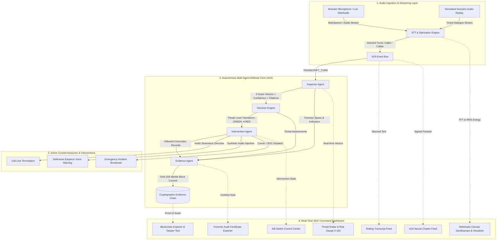

# SENTINEL AI // Real-Time AI Scam-Call Detection & Defense Platform


**SENTINEL AI** is an autonomous real-time cyber-defense platform designed to intercept, analyze, and neutralize telephone and browser-based audio social engineering, financial fraud, and credential-theft attacks. 

By unifying streaming audio ingestion, dual-channel speaker diarization, specialized autonomous agents coordinated over an **Agent-to-Agent (A2A)** messaging protocol, an immutable **SHA-256 cryptographic evidence blockchain**, and active **kill-switch countermeasures**, SENTINEL protects vulnerable users at the point of attack while generating legally defensible forensic evidence.

---

## 📑 Table of Contents

1. [Architecture & Pipeline Overview](#architecture--pipeline-overview)
2. [Multi-Agent Core (A2A Protocol)](#multi-agent-core-a2a-protocol)
3. [Immutable Cryptographic Evidence Chain](#immutable-cryptographic-evidence-chain)
4. [Real-Time SOC Cyber Dashboard](#real-time-soc-cyber-dashboard)
5. [Directory Structure](#directory-structure)
6. [Quick Start & Installation](#quick-start--installation)
7. [API & WebSocket Contracts](#api--websocket-contracts)
8. [Pre-Packaged Test Scenarios](#pre-packaged-test-scenarios)
9. [Testing & Verification](#testing--verification)
10. [Further Documentation](#further-documentation)

---

## Architecture & Pipeline Overview



---

## Multi-Agent Core (A2A Protocol)

- **Speech Engine (`SpeechEngine`)**: Ingests audio packets / WebSpeech transcript turns, tags speaker roles (`CALLER` / `CALLEE`), and broadcasts diarized events.
- **Inspector Agent (`InspectorAgent`)**: Analyzes conversational semantics across 5 core scam vectors:
  - *Urgency & Psychological Coercion* (artificial deadlines, arrest threats, panic induction)
  - *Remote Access & Device Takeover* (AnyDesk, TeamViewer, QuickAssist, Windows Key+R prompts)
  - *OTP & 2FA Interception* (one-time passcode theft, login takeover attempts)
  - *Financial & Anomalous Payments* (Target/Apple gift cards, Bitcoin kiosks, Western Union bail wires)
  - *Authority & Brand Impersonation* (IRS, Microsoft Defender, Chase/Wells Fargo Fraud Departments)
- **Decision Engine (`DecisionEngine`)**: Deterministic multi-tier threat state machine (`GREEN` -> `YELLOW` -> `ORANGE` -> `RED`) tracking threat velocity and triggering automated defensive protocols.
- **Evidence Agent (`EvidenceAgent`)**: Seals conversation events, risk scores, and audio timestamps into a verifiable **SHA-256 Cryptographic Blockchain (Proof-of-Scam)**.
- **Active Intervention Agent (`InterventionAgent`)**: Executes instant line severance (kill-switch), synthetic earpiece warning voice injection, and emergency SOC dispatch logging.

---

## Immutable Cryptographic Evidence Chain

- **Sequential SHA-256 Hashing**: Every detected threat factor and intervention event commits an immutable block where:
  $$\text{Hash}(N) = \text{SHA256}(\text{Index} \parallel \text{Timestamp} \parallel \text{PrevHash} \parallel \text{EventType} \parallel \text{Payload} \parallel \text{Nonce})$$
- **Interactive Tamper Testing**: Security analysts can simulate an adversary corrupting a past block directly in the UI and watch the chain flag the exact corrupted block in real time.
- **Signed Forensic Audit Certificate**: Exports verifiable incident packages with Merkle root seals formatted for law enforcement and financial institution fraud departments.

---

## Real-Time SOC Cyber Dashboard

- **WebAudio Canvas Visualizer**: Real-time frequency spectrum visualizer & oscilloscope.
- **Threat Radar HUD**: Dynamic 0-100 composite risk score gauge, escalation velocity tracker, and 5 scam vector risk bars.
- **Rolling Transcript Stream**: Diarized speaker turns with automated keyword threat badges.
- **A2A Neural Chatter Feed**: Live telemetry log showing inter-agent communications and cryptographic message signatures.
- **Kill-Switch Control Center**: Manual/Automated intervention controls, radio jamming sound effects, and synthetic voice advisory broadcaster.

---

## Directory Structure

```
Unstoppable/
├── backend/
│   ├── agents/               # Autonomous agent implementations (Inspector, Decision, Evidence, Intervention)
│   ├── core/                 # Config, A2A event bus, SHA-256 evidence chain
│   ├── engine/               # Speech-to-Text streaming & realistic scam test scenarios
│   ├── tests/                # Automated pytest test suite
│   ├── main.py               # FastAPI application & WebSocket server
│   └── requirements.txt      # Python dependencies
├── frontend/
│   ├── src/
│   │   ├── components/       # React SOC dashboard components
│   │   ├── hooks/            # WebAudio & WebSocket hooks
│   │   ├── types/            # Strict TypeScript interfaces
│   │   ├── utils/            # Client crypto & sound synthesizers
│   │   ├── App.tsx           # Dashboard layout
│   │   └── main.tsx
│   ├── package.json
│   ├── tailwind.config.js
│   └── vite.config.ts
├── ARCHITECTURE.md           # Deep architectural specification
├── CLAUDE.md                 # Permanent engineering rules
├── README.md                 # Project overview (this file)
├── .env.example              # Environment variables template
├── .gitignore                # Git ignore patterns
└── run_sentinel.bat          # 1-Click Windows startup script
```

---

## Quick Start & Installation

### Prerequisites
- Python 3.10+
- Node.js v18+ and npm

### 1. Launch with One-Click Script (Windows)
```cmd
.\run_sentinel.bat
```

### 2. Manual Startup

#### Backend (FastAPI + WebSockets)
```bash
pip install -r backend/requirements.txt
python -m uvicorn backend.main:app --host 0.0.0.0 --port 8000 --reload
```
Interactive OpenAPI documentation will be available at `http://127.0.0.1:8000/docs`.

#### Frontend (React + TypeScript + Vite)
```bash
cd frontend
npm install
npm run dev
```
Open your browser at `http://localhost:5173`.

---

## API & WebSocket Contracts

### Key REST Endpoints
- `GET /api/health`: System health, active scenario status, and blockchain integrity.
- `GET /api/scenarios`: List all pre-packaged realistic test scenarios.
- `POST /api/scenarios/start`: Launch timed scenario simulation (`{ scenario_id, speed_multiplier }`).
- `POST /api/scenarios/stop`: Terminate active scenario playback.
- `POST /api/live/turn`: Ingest live spoken dialogue turn into the multi-agent defense pipeline.
- `POST /api/analyze`: Synchronous End-to-End Orchestrator Pipeline (Inspector ➔ DecisionEngine ➔ Defensive Countermeasures).
- `POST /api/inspect`: Direct standalone InspectorAgent text analysis (`{ text, speaker, session_id, turn_index }`).
- `POST /api/decision`: Direct standalone DecisionEngine indicator evaluation (`{ indicators, is_benign_advice, speaker }`).
- `POST /api/killswitch/trigger`: Manually engage emergency kill-switch (`{ reason }`).
- `POST /api/killswitch/reset`: Disarm kill-switch and reset defense state.
- `GET /api/killswitch/status`: Retrieve current kill-switch state machine status.
- `GET /api/evidence/chain`: Retrieve complete cryptographic evidence blockchain.
- `POST /api/evidence/verify`: Run full cryptographic integrity verification.
- `POST /api/evidence/tamper-test`: Simulate adversary modifying a block's data.
- `POST /api/evidence/repair`: Re-mine and restore cryptographic chain links.
- `GET /api/evidence/export-audit`: Download signed forensic audit certificate JSON.
- `GET /api/a2a/history`: Retrieve filtered historical inter-agent messages and audit trails.
- `GET /api/a2a/messages/{message_id}`: Retrieve specific A2A message by unique ID.
- `GET /api/a2a/correlations/{correlation_id}`: Trace complete incident message lineage.
- `GET /api/a2a/agents`: List all registered active agents in the internal registry.

### WebSocket Endpoint (`/ws/call-stream`)
- **Broadcast Events**: `INITIAL_STATE`, `TRANSCRIPT_UPDATE`, `INSPECTOR_UPDATE`, `DECISION_UPDATE`, `EVIDENCE_UPDATE`, `KILLSWITCH_UPDATE`, `CHAIN_TAMPERED`, `CHAIN_REPAIRED`, `A2A_MESSAGE`.
- **Client Actions**: `LIVE_SPEECH_TURN`, `START_SCENARIO`, `STOP_SCENARIO`, `TRIGGER_KILLSWITCH`, `RESET_KILLSWITCH`.

---

## Pre-Packaged Test Scenarios

1. **Tech Support Remote Access Scam**: Microsoft Security impersonator instructing victim to install AnyDesk/TeamViewer to access online banking.
2. **Bank Fraud OTP Theft Scam**: Chase/Wells Fargo Fraud department impersonator demanding 6-digit one-time passcode to "cancel" fake $2,450 wire transfer.
3. **IRS Federal Arrest Threat Scam**: Fake IRS Criminal Investigation agent demanding immediate settlement via $500 Target gift cards to avoid arrest warrant.
4. **Grandparent Bail Emergency Scam**: Social engineering distress call impersonating grandson in holding cell needing urgent $3,500 cash bail wire.
5. **Legitimate Bank Support Call**: Routine checking account inquiry demonstrating benign negative control benchmark (remains in GREEN state).

---

## Testing & Verification

Run the automated backend test suite:
```bash
python -m pytest backend/tests -v -o pythonpath=.
```

Run the automated frontend test suite:
```bash
cd frontend
npm test
```

Build the production frontend:
```bash
cd frontend
npm run build
```

---

## Further Documentation

- [ARCHITECTURE.md](file:///c:/Users/Merwin%20Richards%20M/OneDrive/Desktop/Unstoppable/ARCHITECTURE.md): Full technical architecture, mathematical formulas, state machine details, and protocol schemas.
- [CLAUDE.md](file:///c:/Users/Merwin%20Richards%20M/OneDrive/Desktop/Unstoppable/CLAUDE.md): Permanent engineering rules, coding standards, and cryptographic invariants.
